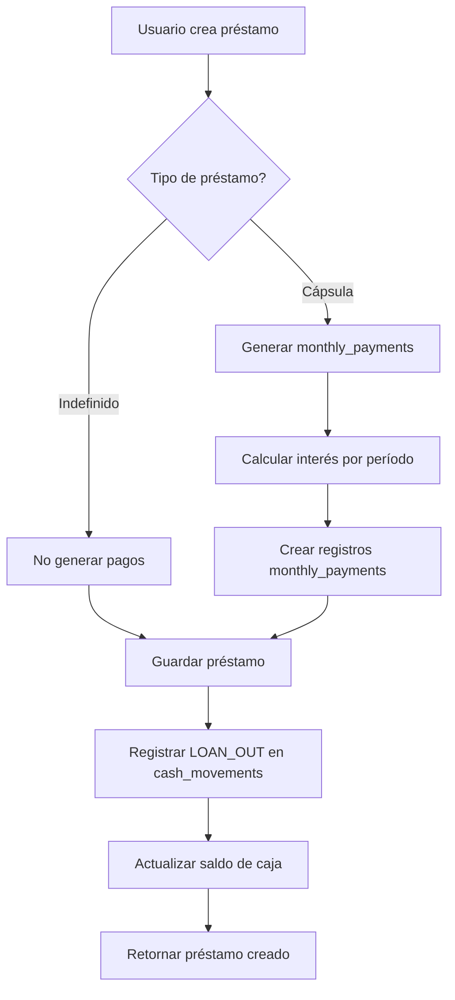
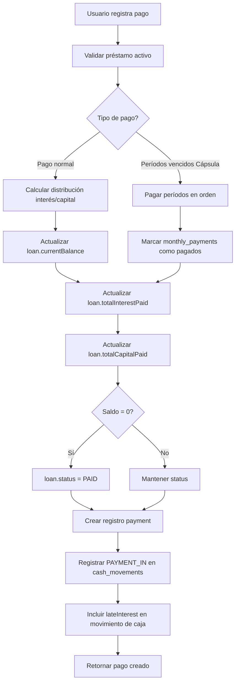
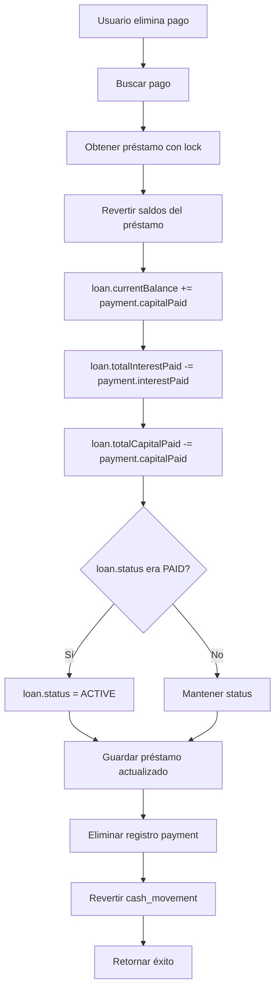

# Sistema de Gestión de Préstamos - Documentación Completa

## Tabla de Contenidos

1. [Descripción General](#descripción-general)
2. [Arquitectura del Sistema](#arquitectura-del-sistema)
3. [Base de Datos](#base-de-datos)
4. [Backend (NestJS)](#backend-nestjs)
5. [Frontend (Angular)](#frontend-angular)
6. [Flujos de Negocio](#flujos-de-negocio)
7. [Reglas de Cálculo](#reglas-de-cálculo)
8. [Endpoints API](#endpoints-api)
9. [Convenciones y Estándares](#convenciones-y-estándares)

---

## Descripción General

Sistema full-stack para la gestión de préstamos personales con seguimiento de pagos, clientes, y reportes financieros.

### Stack Tecnológico

**Backend:**
- NestJS 10+
- TypeORM
- PostgreSQL
- JWT Authentication
- Class Validator

**Frontend:**
- Angular 18+ (Standalone Components)
- Angular Material
- RxJS
- SweetAlert2

---

## Arquitectura del Sistema

### Estructura de Directorios

```
prestamos/
├── prestamos-backend/
│   └── src/
│       ├── auth/              # Autenticación y autorización
│       ├── cash-movements/    # Movimientos de caja
│       ├── customers/         # Gestión de clientes
│       ├── dashboard/         # Estadísticas del dashboard
│       ├── loans/             # Gestión de préstamos
│       ├── payments/          # Registro de pagos
│       ├── reports/           # Generación de reportes
│       ├── users/             # Gestión de usuarios
│       ├── notifications/     # Sistema de notificaciones
│       └── tasks/             # Tareas programadas
│
└── prestamos-frontend/
    └── src/app/
        ├── core/
        │   ├── guards/        # Route guards
        │   ├── interceptors/  # HTTP interceptors
        │   ├── models/        # Interfaces TypeScript
        │   └── services/      # Servicios principales
        ├── features/
        │   ├── auth/          # Login/registro
        │   ├── customers/     # CRUD clientes
        │   ├── dashboard/     # Dashboard principal
        │   ├── loans/         # CRUD préstamos
        │   ├── payments/      # Registro de pagos
        │   └── reports/       # Visualización de reportes
        ├── layouts/           # Layouts de la app
        └── shared/            # Componentes compartidos
```

---

## Base de Datos

### Modelo de Datos (PostgreSQL)

#### Entidad: `customers`

```sql
CREATE TABLE customers (
  id SERIAL PRIMARY KEY,
  first_name VARCHAR NOT NULL,
  last_name VARCHAR NOT NULL,
  phone VARCHAR,
  email VARCHAR,
  address TEXT,
  is_active BOOLEAN DEFAULT true,
  created_by INTEGER REFERENCES users(id),
  created_at TIMESTAMP DEFAULT NOW(),
  updated_at TIMESTAMP DEFAULT NOW()
);
```

**Relaciones:**
- `OneToMany` con `loans`
- `ManyToOne` con `users` (createdBy)

---

#### Entidad: `loans`

```sql
CREATE TABLE loans (
  id SERIAL PRIMARY KEY,
  customer_id INTEGER REFERENCES customers(id),
  loan_date DATE NOT NULL,
  amount INTEGER NOT NULL,                    -- En centavos (sin decimales)
  current_balance INTEGER,                    -- Saldo pendiente
  total_interest_paid INTEGER DEFAULT 0,      -- Total interés pagado
  total_capital_paid INTEGER DEFAULT 0,       -- Total capital pagado
  monthly_interest_rate DECIMAL(5,2) NOT NULL,
  term INTEGER,                               -- Plazo en períodos
  modality VARCHAR,                           -- 'quincenas' o 'meses'
  loan_type VARCHAR,                          -- 'capsula' o 'indefinido'
  status VARCHAR DEFAULT 'ACTIVE',            -- ACTIVE, PAID, OVERDUE, CANCELLED
  notes TEXT,
  months_paid INTEGER DEFAULT 0,
  last_payment_date DATE,
  created_by INTEGER REFERENCES users(id),
  created_at TIMESTAMP DEFAULT NOW(),
  updated_at TIMESTAMP DEFAULT NOW()
);
```

**Tipos de Préstamo:**

1. **Cápsula (Plazo Fijo):**
   - Tiene un plazo definido (`term`)
   - Modalidad: `quincenas` o `meses`
   - Se generan pagos mensuales programados
   - Ejemplo: Préstamo de $10,000 a 12 meses

2. **Indefinido:**
   - Sin plazo definido (`term` = null)
   - Solo paga interés mensualmente
   - El capital se paga cuando el cliente pueda
   - Ejemplo: Línea de crédito revolvente

**Relaciones:**
- `ManyToOne` con `customers`
- `OneToMany` con `payments`
- `OneToMany` con `monthlyPayments`

---

#### Entidad: `payments`

```sql
CREATE TABLE payments (
  id SERIAL PRIMARY KEY,
  loan_id INTEGER REFERENCES loans(id),
  payment_date DATE NOT NULL,
  amount INTEGER NOT NULL,                    -- Monto total del pago
  payment_type VARCHAR DEFAULT 'CAPITAL',     -- CAPITAL, INTEREST, BOTH
  payment_method VARCHAR DEFAULT 'CASH',
  receipt_number VARCHAR,
  notes TEXT,
  interest_paid INTEGER DEFAULT 0,            -- Interés incluido en el pago
  capital_paid INTEGER DEFAULT 0,             -- Capital incluido en el pago
  late_interest INTEGER DEFAULT 0,            -- Cargo extra (mora/penalización)
  created_by INTEGER REFERENCES users(id),
  created_at TIMESTAMP DEFAULT NOW(),
  updated_at TIMESTAMP DEFAULT NOW()
);
```

**Campos Clave:**
- `amount`: Suma de `interest_paid` + `capital_paid`
- `late_interest`: **NO se suma al amount**, es un cargo adicional separado
- El cargo extra NO afecta el `current_balance` del préstamo

**Relaciones:**
- `ManyToOne` con `loans`
- `ManyToOne` con `users` (createdBy)

---

#### Entidad: `monthly_payments`

```sql
CREATE TABLE monthly_payments (
  id SERIAL PRIMARY KEY,
  loan_id INTEGER REFERENCES loans(id) ON DELETE CASCADE,
  due_date DATE NOT NULL,
  expected_amount INTEGER NOT NULL,
  paid_amount INTEGER DEFAULT 0,
  interest_paid INTEGER DEFAULT 0,
  capital_paid INTEGER DEFAULT 0,
  is_paid BOOLEAN DEFAULT false,
  payment_date DATE,
  created_at TIMESTAMP DEFAULT NOW()
);
```

**Uso:**
- Solo para préstamos tipo **Cápsula**
- Se generan automáticamente al crear el préstamo
- Se marcan como pagados cuando se registra un pago

**Relaciones:**
- `ManyToOne` con `loans` (CASCADE delete)

---

#### Entidad: `cash_movements`

```sql
CREATE TABLE cash_movements (
  id SERIAL PRIMARY KEY,
  movement_date DATE NOT NULL,
  movement_type VARCHAR NOT NULL,             -- LOAN_OUT, PAYMENT_IN, EXPENSE, DEPOSIT
  amount INTEGER NOT NULL,
  balance_after INTEGER NOT NULL,
  reference_type VARCHAR,                     -- 'loan' o 'payment'
  reference_id INTEGER,
  description TEXT,
  created_by INTEGER REFERENCES users(id),
  created_at TIMESTAMP DEFAULT NOW()
);
```

**Tipos de Movimiento:**
- `LOAN_OUT`: Salida de dinero (préstamo)
- `PAYMENT_IN`: Entrada de dinero (pago recibido)
- `EXPENSE`: Gasto
- `DEPOSIT`: Depósito

**Relaciones:**
- `ManyToOne` con `users` (createdBy)

---

#### Entidad: `users`

```sql
CREATE TABLE users (
  id SERIAL PRIMARY KEY,
  username VARCHAR UNIQUE NOT NULL,
  email VARCHAR UNIQUE NOT NULL,
  password VARCHAR NOT NULL,                   -- Hash bcrypt
  role VARCHAR DEFAULT 'USER',
  is_active BOOLEAN DEFAULT true,
  created_at TIMESTAMP DEFAULT NOW(),
  updated_at TIMESTAMP DEFAULT NOW()
);
```

---

## Backend (NestJS)

### Módulos Principales

#### 1. Auth Module (`src/auth/`)

**Responsabilidades:**
- Autenticación con JWT
- Login/registro
- Guards para proteger rutas

**Archivos clave:**
- `auth.service.ts`: Lógica de autenticación
- `jwt.strategy.ts`: Estrategia de validación JWT
- `jwt-auth.guard.ts`: Guard para proteger endpoints

---

#### 2. Customers Module (`src/customers/`)

**Responsabilidades:**
- CRUD de clientes
- Validación de datos

**Endpoints:**
- `GET /customers` - Listar todos
- `GET /customers/:id` - Obtener uno
- `POST /customers` - Crear
- `PATCH /customers/:id` - Actualizar
- `DELETE /customers/:id` - Eliminar (soft delete)

---

#### 3. Loans Module (`src/loans/`)

**Responsabilidades:**
- CRUD de préstamos
- Generación de pagos mensuales (Cápsula)
- Cálculo de intereses
- Actualización de saldos

**Archivos clave:**
- `loans.service.ts`: Lógica de negocio
- `loan.entity.ts`: Entidad TypeORM
- `monthly-payment.entity.ts`: Pagos programados

**Endpoints:**
- `GET /loans` - Listar todos
- `GET /loans/:id` - Obtener uno con detalles
- `POST /loans` - Crear préstamo
- `PATCH /loans/:id` - Actualizar
- `DELETE /loans/:id` - Eliminar

**Lógica Especial:**

1. **Al crear préstamo Cápsula:**
   - Se calculan los pagos mensuales/quincenales
   - Se generan registros en `monthly_payments`
   - Se registra movimiento de caja (LOAN_OUT)

2. **Al crear préstamo Indefinido:**
   - No se generan pagos programados
   - Solo se registra el préstamo y movimiento de caja

---

#### 4. Payments Module (`src/payments/`)

**Responsabilidades:**
- Registro de pagos
- Actualización de saldos del préstamo
- Cálculo de distribución interés/capital
- Registro de movimientos de caja

**Archivo clave:** `payments.service.ts`

**Método principal:** `create(createPaymentDto, userId)`

**Flujo de Pago:**

```typescript
// 1. Validar préstamo activo
if (loan.status !== ACTIVE && loan.status !== OVERDUE) {
  throw error;
}

// 2. Calcular distribución del pago
const interestRate = parseFloat(loan.monthlyInterestRate) / 100;
const interestForPeriod = Math.ceil(loan.amount * interestRate);

if (totalPaymentReceived > interestForPeriod) {
  actualInterestPaid = interestForPeriod;
  actualCapitalPaid = totalPaymentReceived - interestForPeriod;
} else {
  actualInterestPaid = totalPaymentReceived;
  actualCapitalPaid = 0;
}

// 3. Actualizar préstamo
loan.currentBalance -= actualCapitalPaid;
loan.totalInterestPaid += actualInterestPaid;
loan.totalCapitalPaid += actualCapitalPaid;
loan.monthsPaid += 1;

// 4. Marcar como pagado si saldo = 0
if (loan.currentBalance <= 0) {
  loan.status = PAID;
}

// 5. Crear registro de pago
const payment = {
  amount: totalPaymentReceived,
  interestPaid: actualInterestPaid,
  capitalPaid: actualCapitalPaid,
  lateInterest: lateInterest || 0,
  // ...
};

// 6. Registrar movimiento de caja
const totalWithLateInterest = totalPaymentReceived + (lateInterest || 0);
await cashMovementsService.recordMovement(
  PAYMENT_IN,
  totalWithLateInterest,
  description
);
```

**Pago de Períodos Vencidos (Cápsula):**

```typescript
if (overduePeriodsPaid > 0) {
  // Filtrar pagos vencidos no pagados
  const overduePayments = loan.monthlyPayments
    .filter(mp => !mp.isPaid && mp.dueDate < now)
    .sort((a, b) => a.dueDate - b.dueDate);

  // Pagar cada período vencido
  for (let i = 0; i < overduePeriodsPaid; i++) {
    const mp = overduePayments[i];

    // Calcular interés y capital del período
    const interestForPeriod = Math.ceil(loan.amount * interestRate);
    const capitalForPeriod = mp.expectedAmount - interestForPeriod;

    // Marcar como pagado
    mp.isPaid = true;
    mp.paidAmount = mp.expectedAmount;
    mp.interestPaid = interestForPeriod;
    mp.capitalPaid = capitalForPeriod;

    await save(mp);
  }
}
```

---

#### 5. Dashboard Module (`src/dashboard/`)

**Responsabilidades:**
- Calcular métricas del sistema
- Estadísticas de préstamos
- Detección de préstamos vencidos

**Archivo clave:** `dashboard.service.ts`

**Método principal:** `getDashboardStats()`

**Métricas Calculadas:**

```typescript
interface DashboardStats {
  // Métricas principales
  dineroRestado: number;              // Total prestado acumulado
  capitalRecuperado: number;          // Total capital que regresó
  interesRecabado: number;            // Total intereses cobrados
  cargosExtrasRecaudados: number;     // Total cargos extra (mora)
  capitalEnTransito: number;          // Saldo pendiente (préstamos activos)
  intersesMensual: number;            // Interés del mes actual

  // Métricas de morosidad
  prestamosVencidos: number;          // Cantidad de préstamos sin pagar
  montoVencido: number;               // Monto total vencido

  // Métricas generales
  totalPrestamos: number;
  prestamosActivos: number;
  prestamosCompletados: number;

  // Métricas por tipo
  totalRecaudadoCapsula: number;      // Total recaudado tipo Cápsula
  totalRecaudadoIndefinido: number;   // Total recaudado tipo Indefinido

  // Listas detalladas
  prestamosVencidosDetalle: Array<{
    id: number;
    customer: string;
    amount: number;
    currentBalance: number;
    daysSinceLastPayment: number;
  }>;
  prestamosPorVencer: Array<{
    id: number;
    customer: string;
    currentBalance: number;
    monthlyPayment: number;
    daysSinceLastPayment: number;
  }>;
}
```

**Lógica de Cálculo:**

1. **Total Recaudado por Tipo:**
```typescript
// Para cada préstamo
const totalRecaudadoLoan =
  loan.totalCapitalPaid +
  loan.totalInterestPaid +
  loan.payments.reduce((sum, p) => sum + p.lateInterest, 0);

if (loan.loanType === 'capsula') {
  totalRecaudadoCapsula += totalRecaudadoLoan;
} else if (loan.loanType === 'indefinido') {
  totalRecaudadoIndefinido += totalRecaudadoLoan;
}
```

2. **Préstamos Vencidos:**
```typescript
const isOverdue = (loan) => {
  if (!loan.lastPaymentDate) {
    // Nunca ha pagado
    return getDaysSinceDate(loan.loanDate) > 30;
  }
  // Ya pagó antes
  return getDaysSinceLastPayment(loan.lastPaymentDate) > 30;
};
```

3. **Préstamos por Vencer:**
```typescript
// Préstamos activos que no están vencidos pero están cerca (23+ días)
if (loan.status === ACTIVE && !isOverdue) {
  const daysSinceLastPayment = getDaysSinceLastPayment(loan.lastPaymentDate);
  if (daysSinceLastPayment >= 23) {
    prestamosPorVencer.push(loan);
  }
}
```

---

#### 6. Cash Movements Module (`src/cash-movements/`)

**Responsabilidades:**
- Registrar movimientos de caja
- Calcular saldo después de cada movimiento
- Revertir movimientos (al eliminar pagos)

**Archivo clave:** `cash-movements.service.ts`

**Métodos principales:**

```typescript
async recordMovement(
  type: MovementType,
  amount: number,
  description: string,
  userId: number,
  referenceType?: string,
  referenceId?: number,
  transactionalManager?: EntityManager
): Promise<CashMovement>

async revertMovement(
  referenceType: string,
  referenceId: number,
  transactionalManager: EntityManager
): Promise<void>
```

---

### Convenciones de Código Backend

1. **Todos los montos son ENTEROS (sin decimales)**
   - Se usa `Math.ceil()` para redondear hacia arriba
   - Nunca se usa Decimal.js

2. **Transacciones**
   - Operaciones de pago/préstamo usan transacciones de TypeORM
   - Lock pesimista para evitar condiciones de carrera

3. **DTOs con Validación**
   ```typescript
   export class CreatePaymentDto {
     @IsNumber()
     loanId: number;

     @IsOptional()
     @IsNumber()
     amount?: number;

     @IsOptional()
     @IsNumber()
     lateInterest?: number;
   }
   ```

4. **Manejo de Errores**
   ```typescript
   try {
     // lógica
   } catch (error) {
     if (error instanceof NotFoundException) {
       throw error;
     }
     throw new InternalServerErrorException('Mensaje genérico');
   }
   ```

---

## Frontend (Angular)

### Arquitectura Frontend

#### Estructura Modular

**Core Module** (`src/app/core/`)
- Guards: Protección de rutas
- Interceptors: HTTP interceptors (JWT, errores)
- Services: Servicios singleton
- Models: Interfaces TypeScript

**Features Module** (`src/app/features/`)
- Cada feature es independiente (lazy loading)
- Componentes standalone (Angular 18+)

**Shared Module** (`src/app/shared/`)
- Componentes reutilizables
- Pipes custom
- Directivas

---

### Servicios Principales

#### 1. Auth Service (`core/services/auth.service.ts`)

```typescript
class AuthService {
  login(username: string, password: string): Observable<LoginResponse>
  logout(): void
  getCurrentUser(): Observable<User>
  isAuthenticated(): boolean
  getToken(): string | null
}
```

---

#### 2. Loans Service (`core/services/loans.service.ts`)

```typescript
class LoansService {
  getLoans(): Observable<Loan[]>
  getLoanById(id: number): Observable<Loan>
  createLoan(loan: CreateLoanDto): Observable<Loan>
  updateLoan(id: number, loan: UpdateLoanDto): Observable<Loan>
  deleteLoan(id: number): Observable<void>
}
```

---

#### 3. Payments Service (`core/services/payments.service.ts`)

```typescript
class PaymentsService {
  getPayments(): Observable<Payment[]>
  getPaymentsByLoan(loanId: number): Observable<Payment[]>
  createPayment(payment: CreatePaymentDto): Observable<Payment>
  deletePayment(id: number): Observable<void>
}
```

---

#### 4. Dashboard Service (`core/services/dashboard.service.ts`)

```typescript
interface DashboardStats {
  dineroRestado: number;
  capitalRecuperado: number;
  interesRecabado: number;
  cargosExtrasRecaudados: number;
  capitalEnTransito: number;
  intersesMensual: number;
  prestamosVencidos: number;
  montoVencido: number;
  totalPrestamos: number;
  prestamosActivos: number;
  prestamosCompletados: number;
  totalRecaudadoCapsula: number;
  totalRecaudadoIndefinido: number;
  prestamosVencidosDetalle: any[];
  prestamosPorVencer: any[];
}

class DashboardService {
  getDashboardStats(): Observable<DashboardStats>
  getLoansWithPaymentStatus(): Observable<any[]>
}
```

---

### Componentes Principales

#### 1. Dashboard Component

**Ruta:** `/dashboard`

**Funcionalidad:**
- Muestra tarjetas con métricas principales
- Gráficos de rendimiento (recuperación, puntualidad, margen)
- Lista de préstamos vencidos
- Lista de préstamos por vencer
- Indicadores por tipo de préstamo

**Métodos clave:**
```typescript
class DashboardComponent {
  loadDashboard(): void
  getRecoveryPercentage(): number
  getPunctualityPercentage(): number
  getProfitMargin(): number
  getTotalCollected(): number
  viewOverdueLoans(): void
  generateOverdueReport(): void
}
```

**Tarjetas del Dashboard:**

1. **Dinero Prestado** - Total acumulado prestado
2. **Capital Recuperado** - Total capital que regresó
3. **Interés Recabado** - Total intereses cobrados
4. **Cargos Extras Recaudados** - Total mora/penalizaciones
5. **Total Recaudado** - Capital + Interés + Extras
6. **Total Recaudado Cápsula** - Solo préstamos cápsula
7. **Total Recaudado Indefinido** - Solo préstamos indefinidos
8. **Capital en Tránsito** - Saldo pendiente activo
9. **Interés Mensual** - Interés del mes actual
10. **Préstamos Vencidos** - Cantidad y monto vencido

**Estilos de tarjetas:**
```css
.money-lent { background: linear-gradient(135deg, #667eea 0%, #764ba2 100%); }
.capital-recovered { background: linear-gradient(135deg, #f093fb 0%, #f5576c 100%); }
.interest-collected { background: linear-gradient(135deg, #4facfe 0%, #00f2fe 100%); }
.extra-charges { background: linear-gradient(135deg, #ff9966 0%, #ff5e62 100%); }
.total-collected { background: linear-gradient(135deg, #84fab0 0%, #8fd3f4 100%); }
.capsula-collected { background: linear-gradient(135deg, #89f7fe 0%, #66a6ff 100%); }
.indefinido-collected { background: linear-gradient(135deg, #c471f5 0%, #fa71cd 100%); }
.capital-transit { background: linear-gradient(135deg, #43e97b 0%, #38f9d7 100%); }
.monthly-interest { background: linear-gradient(135deg, #fa709a 0%, #fee140 100%); }
.overdue-loans { background: linear-gradient(135deg, #ff9a9e 0%, #fecfef 100%); }
```

---

#### 2. Loan Details Component

**Ruta:** `/loans/:id`

**Funcionalidad:**
- Muestra información detallada del préstamo
- Desglose de pagos realizados
- Saldo actual y progreso
- Historial de pagos

**Display de Total Pagado:**
```html
<div class="info-item">
  <strong>Total Pagado:</strong>
  <span style="color: #4caf50; font-weight: bold;">
    {{ getTotalPaid() | currency:'MXN':'symbol':'1.0-0' }}
  </span>
</div>
<div class="info-item" style="padding-left: 20px;">
  <strong>• Interés:</strong>
  <span>{{ loan.totalInterestPaid | currency:'MXN':'symbol':'1.0-0' }}</span>
</div>
<div class="info-item" style="padding-left: 20px;">
  <strong>• Capital:</strong>
  <span>{{ loan.totalCapitalPaid | currency:'MXN':'symbol':'1.0-0' }}</span>
</div>
@if (loan.totalExtraChargesPaid && loan.totalExtraChargesPaid > 0) {
  <div class="info-item" style="padding-left: 20px;">
    <strong>• Cargos Extra:</strong>
    <span style="color: #ff9800;">
      {{ loan.totalExtraChargesPaid | currency:'MXN':'symbol':'1.0-0' }}
    </span>
  </div>
}
```

**Método de cálculo:**
```typescript
getTotalPaid(): number {
  if (!this.loan) return 0;

  const totalInterest = parseFloat(String(this.loan.totalInterestPaid || 0));
  const totalCapital = parseFloat(String(this.loan.totalCapitalPaid || 0));
  const totalExtra = this.loan.totalExtraChargesPaid || 0;

  return totalInterest + totalCapital + totalExtra;
}
```

---

#### 3. Payment Form Component

**Ruta:** `/payments/new`

**Funcionalidad:**
- Selección de préstamo
- Ingreso de monto de pago
- Campo opcional para cargo extra
- Validación de montos
- Registro del pago

**Campos del formulario:**
```typescript
interface PaymentForm {
  loanId: number;
  paymentDate: Date;
  amount?: number;              // Monto total del pago
  capitalAmount?: number;       // O capital específico
  interestAmount?: number;      // E interés específico
  lateInterest?: number;        // Cargo extra (opcional)
  paymentMethod: string;        // CASH, TRANSFER, etc.
  notes?: string;
}
```

**Display de información del préstamo:**
```html
<div class="info-item">
  <span style="color: #4caf50; font-weight: bold;">
    Total Pagado: {{ getLoanTotalPaid() | currency:'MXN':'symbol':'1.0-0' }}
  </span>
</div>
<div class="info-item" style="padding-left: 32px;">
  <span style="font-size: 0.9em;">
    • Interés: {{ selectedLoan.totalInterestPaid | currency:'MXN':'symbol':'1.0-0' }}
  </span>
</div>
<div class="info-item" style="padding-left: 32px;">
  <span style="font-size: 0.9em;">
    • Capital: {{ selectedLoan.totalCapitalPaid | currency:'MXN':'symbol':'1.0-0' }}
  </span>
</div>
```

**Historial de pagos:**
```html
@for (payment of paymentHistory; track payment.id) {
  <div class="payment-item">
    <div class="payment-amount">
      <strong>Total: {{ getPaymentTotal(payment) | currency:'MXN':'symbol':'1.0-0' }}</strong>
    </div>
    <div class="payment-breakdown">
      Interés: {{ payment.interestPaid | currency:'MXN':'symbol':'1.0-0' }} |
      Capital: {{ payment.capitalPaid | currency:'MXN':'symbol':'1.0-0' }} |
      Cargo Extra: {{ payment.lateInterest | currency:'MXN':'symbol':'1.0-0' }}
    </div>
  </div>
}
```

**Métodos de cálculo:**
```typescript
getPaymentTotal(payment: any): number {
  const interest = parseFloat(payment.interestPaid) || 0;
  const capital = parseFloat(payment.capitalPaid) || 0;
  const extra = payment.lateInterest || 0;
  return interest + capital + extra;
}

getLoanTotalPaid(): number {
  if (!this.selectedLoan) return 0;

  const interest = parseFloat(String(this.selectedLoan.totalInterestPaid || 0));
  const capital = parseFloat(String(this.selectedLoan.totalCapitalPaid || 0));
  const extra = this.selectedLoan.totalExtraChargesPaid || 0;

  return interest + capital + extra;
}
```

---

### Pipes Personalizados

```typescript
// Currency pipe con formato MXN
{{ value | currency:'MXN':'symbol':'1.0-0' }}

// Date pipe
{{ date | date:'dd/MM/yyyy' }}
```

---

### Guards

#### AuthGuard

```typescript
class AuthGuard implements CanActivate {
  canActivate(route, state): boolean {
    if (authService.isAuthenticated()) {
      return true;
    }
    router.navigate(['/login']);
    return false;
  }
}
```

---

### Interceptors

#### JWT Interceptor

```typescript
class JwtInterceptor implements HttpInterceptor {
  intercept(req, next): Observable<HttpEvent<any>> {
    const token = authService.getToken();
    if (token) {
      req = req.clone({
        setHeaders: { Authorization: `Bearer ${token}` }
      });
    }
    return next.handle(req);
  }
}
```

#### Error Interceptor

```typescript
class ErrorInterceptor implements HttpInterceptor {
  intercept(req, next): Observable<HttpEvent<any>> {
    return next.handle(req).pipe(
      catchError((error: HttpErrorResponse) => {
        let errorMessage = 'Error desconocido';

        if (error.error instanceof ErrorEvent) {
          // Error del cliente
          errorMessage = error.error.message;
        } else {
          // Error del servidor
          errorMessage = error.error?.message || error.message;
        }

        Swal.fire('Error', errorMessage, 'error');
        return throwError(() => error);
      })
    );
  }
}
```

---

## Flujos de Negocio

### 1. Flujo de Creación de Préstamo



**Detalles:**

1. **Validar datos del préstamo**
   - Monto > 0
   - Cliente existe
   - Tasa de interés válida

2. **Calcular campos del préstamo**
   ```typescript
   loan.currentBalance = loan.amount;
   loan.totalInterestPaid = 0;
   loan.totalCapitalPaid = 0;
   loan.status = LoanStatus.ACTIVE;
   ```

3. **Si es Cápsula:**
   ```typescript
   const interestRate = parseFloat(loan.monthlyInterestRate) / 100;
   let periodRate = interestRate;

   if (loan.modality === 'quincenas') {
     periodRate = interestRate / 2;  // Mitad para quincenas
   }

   const periodsCount = loan.modality === 'quincenas'
     ? loan.term * 2
     : loan.term;

   for (let i = 0; i < periodsCount; i++) {
     const dueDate = calculateDueDate(loan.loanDate, i, loan.modality);
     const expectedAmount = Math.ceil(loan.amount * periodRate);

     await monthlyPaymentsRepository.save({
       loan,
       dueDate,
       expectedAmount,
       isPaid: false
     });
   }
   ```

4. **Registrar movimiento de caja**
   ```typescript
   await cashMovementsService.recordMovement(
     MovementType.LOAN_OUT,
     loan.amount,
     `Préstamo #${loan.id} - ${customer.firstName} ${customer.lastName}`,
     userId,
     'loan',
     loan.id
   );
   ```

---

### 2. Flujo de Registro de Pago



**Detalles:**

1. **Validaciones iniciales**
   ```typescript
   if (loan.status !== LoanStatus.ACTIVE) {
     throw new BadRequestException('Préstamo no activo');
   }

   if (loan.currentBalance <= 0) {
     throw new BadRequestException('Préstamo ya pagado');
   }
   ```

2. **Calcular distribución del pago**
   ```typescript
   const monthlyInterestRate = parseFloat(loan.monthlyInterestRate) / 100;
   let interestRateForPeriod = monthlyInterestRate;

   // Ajustar para quincenas en préstamos Cápsula
   if (loan.loanType === 'Cápsula' && loan.modality === 'quincenas') {
     interestRateForPeriod = monthlyInterestRate / 2;
   }

   const interestForPeriod = Math.ceil(loan.amount * interestRateForPeriod);

   if (totalPaymentReceived > interestForPeriod) {
     actualInterestPaid = interestForPeriod;
     actualCapitalPaid = totalPaymentReceived - interestForPeriod;
   } else {
     actualInterestPaid = totalPaymentReceived;
     actualCapitalPaid = 0;
   }

   // Limitar capital al saldo actual
   if (actualCapitalPaid > currentBalance) {
     actualCapitalPaid = currentBalance;
   }
   ```

3. **Actualizar préstamo**
   ```typescript
   loan.currentBalance = currentBalance - actualCapitalPaid;
   loan.totalInterestPaid += actualInterestPaid;
   loan.totalCapitalPaid += actualCapitalPaid;
   loan.monthsPaid += 1;
   loan.lastPaymentDate = new Date(paymentDate);

   if (loan.currentBalance <= 0) {
     loan.currentBalance = 0;
     loan.status = LoanStatus.PAID;
   }
   ```

4. **Crear registro de pago**
   ```typescript
   const payment = {
     loan,
     paymentDate: new Date(paymentDate),
     amount: totalPaymentReceived,  // interés + capital
     paymentType: determinePaymentType(actualCapitalPaid, actualInterestPaid),
     interestPaid: actualInterestPaid,
     capitalPaid: actualCapitalPaid,
     lateInterest: lateInterest || 0,  // Cargo extra separado
     // ...
   };
   ```

5. **Registrar movimiento de caja**
   ```typescript
   const totalWithLateInterest = totalPaymentReceived + (lateInterest || 0);

   await cashMovementsService.recordMovement(
     MovementType.PAYMENT_IN,
     totalWithLateInterest,  // Incluye cargo extra
     `Pago #${payment.id} - Préstamo #${loanId} - Interés: ${actualInterestPaid}, Capital: ${actualCapitalPaid}${lateInterest > 0 ? `, Mora: ${lateInterest}` : ''}`,
     userId,
     'payment',
     payment.id
   );
   ```

**IMPORTANTE:**
- El cargo extra (`lateInterest`) NO se suma a `amount`
- El cargo extra NO afecta el `currentBalance` del préstamo
- El cargo extra SÍ se incluye en el movimiento de caja
- El cargo extra SÍ se cuenta en las estadísticas del dashboard

---

### 3. Flujo de Eliminación de Pago



---

## Reglas de Cálculo

### 1. Cálculo de Intereses

**Regla General:**
```typescript
const interestAmount = Math.ceil(loan.amount * (interestRate / 100));
```

**Para Préstamos Cápsula con Quincenas:**
```typescript
const monthlyRate = parseFloat(loan.monthlyInterestRate) / 100;
const quincenalRate = monthlyRate / 2;
const interestAmount = Math.ceil(loan.amount * quincenalRate);
```

**Ejemplos:**

1. **Préstamo Indefinido de $10,000 al 5% mensual:**
   ```
   Interés mensual = Math.ceil(10000 * 0.05) = 500
   ```

2. **Préstamo Cápsula de $10,000 al 5% mensual, modalidad quincenas:**
   ```
   Interés quincenal = Math.ceil(10000 * 0.025) = 250
   ```

---

### 2. Distribución de Pagos

**Orden de aplicación:**
1. Primero se cubre el INTERÉS del período
2. El excedente se aplica al CAPITAL

**Ejemplo 1: Pago completo**
```
Préstamo: $10,000 al 5%
Interés del período: $500
Pago recibido: $1,500

Distribución:
- Interés pagado: $500
- Capital pagado: $1,000
- Nuevo saldo: $9,000
```

**Ejemplo 2: Pago parcial**
```
Préstamo: $10,000 al 5%
Interés del período: $500
Pago recibido: $300

Distribución:
- Interés pagado: $300
- Capital pagado: $0
- Nuevo saldo: $10,000 (sin cambio)
```

---

### 3. Cálculo de Préstamos Vencidos

**Criterio:**
- Si nunca ha pagado: `días desde préstamo > 30`
- Si ya pagó antes: `días desde último pago > 30`

```typescript
const isLoanOverdue = (loan: Loan): boolean => {
  if (!loan.lastPaymentDate) {
    const daysSinceLoan = getDaysSinceDate(loan.loanDate);
    return daysSinceLoan > 30;
  }

  const daysSinceLastPayment = getDaysSinceLastPayment(loan.lastPaymentDate);
  return daysSinceLastPayment > 30;
};
```

---

### 4. Cálculo de Préstamos por Vencer

**Criterio:**
- Préstamo activo
- No está vencido
- Han pasado 23+ días desde el último pago

```typescript
const isLoanDueSoon = (loan: Loan): boolean => {
  if (loan.status !== LoanStatus.ACTIVE) return false;
  if (isLoanOverdue(loan)) return false;

  const daysSinceLastPayment = getDaysSinceLastPayment(loan.lastPaymentDate);
  return daysSinceLastPayment >= 23;
};
```

---

### 5. Métricas del Dashboard

**Capital Recuperado:**
```typescript
capitalRecuperado = Σ (loan.totalCapitalPaid) para todos los préstamos
```

**Interés Recabado:**
```typescript
interesRecabado = Σ (loan.totalInterestPaid) para todos los préstamos
```

**Cargos Extras Recaudados:**
```typescript
cargosExtrasRecaudados = Σ Σ (payment.lateInterest)
                         para todos los préstamos y sus pagos
```

**Total Recaudado:**
```typescript
totalRecaudado = capitalRecuperado + interesRecabado + cargosExtrasRecaudados
```

**Capital en Tránsito:**
```typescript
capitalEnTransito = Σ (loan.currentBalance)
                   para préstamos con status = ACTIVE
```

**Total Recaudado por Tipo:**
```typescript
// Para cada préstamo
const totalRecaudadoLoan =
  loan.totalCapitalPaid +
  loan.totalInterestPaid +
  Σ (payment.lateInterest para payments del loan);

if (loan.loanType === 'capsula') {
  totalRecaudadoCapsula += totalRecaudadoLoan;
} else if (loan.loanType === 'indefinido') {
  totalRecaudadoIndefinido += totalRecaudadoLoan;
}
```

**Interés Mensual:**
```typescript
// Suma de intereses pagados en el mes actual
const startOfMonth = new Date(year, month, 1);
const endOfMonth = new Date(year, month + 1, 0);

intersesMensual = Σ (payment.interestPaid)
                 para payments donde paymentDate entre startOfMonth y endOfMonth
```

**Tasa de Recuperación:**
```typescript
tasaRecuperacion = (capitalRecuperado / dineroRestado) * 100
```

**Tasa de Puntualidad:**
```typescript
prestamosActivos = count(préstamos con status = ACTIVE)
prestamosVencidos = count(préstamos vencidos)
prestamosPuntuales = prestamosActivos - prestamosVencidos

tasaPuntualidad = (prestamosPuntuales / prestamosActivos) * 100
```

**Margen de Ganancia:**
```typescript
margenGanancia = (interesRecabado / capitalRecuperado) * 100
```

---

## Endpoints API

### Base URL
```
http://localhost:3000/api
```

### Authentication

#### POST `/auth/login`
```json
Request:
{
  "username": "admin",
  "password": "password123"
}

Response:
{
  "access_token": "eyJhbGciOiJIUzI1NiIsInR5cCI6IkpXVCJ9...",
  "user": {
    "id": 1,
    "username": "admin",
    "email": "admin@example.com",
    "role": "ADMIN"
  }
}
```

---

### Customers

#### GET `/customers`
Lista todos los clientes

```json
Response:
[
  {
    "id": 1,
    "firstName": "Juan",
    "lastName": "Pérez",
    "phone": "5551234567",
    "email": "juan@example.com",
    "address": "Calle Principal 123",
    "isActive": true,
    "createdAt": "2024-01-15T10:00:00Z"
  }
]
```

#### GET `/customers/:id`
Obtiene un cliente por ID

#### POST `/customers`
```json
Request:
{
  "firstName": "Juan",
  "lastName": "Pérez",
  "phone": "5551234567",
  "email": "juan@example.com",
  "address": "Calle Principal 123"
}
```

#### PATCH `/customers/:id`
Actualiza un cliente

#### DELETE `/customers/:id`
Elimina un cliente (soft delete)

---

### Loans

#### GET `/loans`
Lista todos los préstamos

```json
Response:
[
  {
    "id": 1,
    "customer": {
      "id": 1,
      "firstName": "Juan",
      "lastName": "Pérez"
    },
    "loanDate": "2024-01-15",
    "amount": 10000,
    "currentBalance": 8500,
    "totalInterestPaid": 1000,
    "totalCapitalPaid": 1500,
    "monthlyInterestRate": "5.00",
    "term": 12,
    "modality": "meses",
    "loanType": "capsula",
    "status": "ACTIVE",
    "monthsPaid": 3,
    "lastPaymentDate": "2024-04-15"
  }
]
```

#### GET `/loans/:id`
Obtiene un préstamo con detalles completos

```json
Response:
{
  "id": 1,
  "customer": { ... },
  "loanDate": "2024-01-15",
  "amount": 10000,
  "currentBalance": 8500,
  "totalInterestPaid": 1000,
  "totalCapitalPaid": 1500,
  "monthlyInterestRate": "5.00",
  "term": 12,
  "modality": "meses",
  "loanType": "capsula",
  "status": "ACTIVE",
  "monthsPaid": 3,
  "lastPaymentDate": "2024-04-15",
  "payments": [ ... ],
  "monthlyPayments": [ ... ]
}
```

#### POST `/loans`
```json
Request:
{
  "customerId": 1,
  "loanDate": "2024-01-15",
  "amount": 10000,
  "monthlyInterestRate": 5,
  "term": 12,
  "modality": "meses",
  "loanType": "capsula",
  "notes": "Préstamo para negocio"
}
```

#### PATCH `/loans/:id`
Actualiza un préstamo

#### DELETE `/loans/:id`
Elimina un préstamo

---

### Payments

#### GET `/payments`
Lista todos los pagos

```json
Response:
[
  {
    "id": 1,
    "loan": {
      "id": 1,
      "customer": { ... }
    },
    "paymentDate": "2024-02-15",
    "amount": 1500,
    "paymentType": "BOTH",
    "paymentMethod": "CASH",
    "receiptNumber": "REC-202402-0001",
    "interestPaid": 500,
    "capitalPaid": 1000,
    "lateInterest": 100,
    "createdAt": "2024-02-15T14:30:00Z"
  }
]
```

#### GET `/payments/loan/:loanId`
Lista pagos de un préstamo específico

#### POST `/payments`
```json
Request (Opción 1 - Monto total):
{
  "loanId": 1,
  "paymentDate": "2024-02-15",
  "amount": 1500,
  "lateInterest": 100,
  "paymentMethod": "CASH",
  "notes": "Pago mensual"
}

Request (Opción 2 - Desglosado):
{
  "loanId": 1,
  "paymentDate": "2024-02-15",
  "capitalAmount": 1000,
  "interestAmount": 500,
  "lateInterest": 100,
  "paymentMethod": "CASH",
  "notes": "Pago mensual"
}

Request (Opción 3 - Períodos vencidos para Cápsula):
{
  "loanId": 1,
  "paymentDate": "2024-02-15",
  "overduePeriodsPaid": 2,
  "lateInterest": 100,
  "paymentMethod": "CASH"
}
```

#### DELETE `/payments/:id`
Elimina un pago y revierte los cambios en el préstamo

---

### Dashboard

#### GET `/dashboard/stats`
Obtiene todas las estadísticas del dashboard

```json
Response:
{
  "dineroRestado": 50000,
  "capitalRecuperado": 15000,
  "interesRecabado": 3000,
  "cargosExtrasRecaudados": 500,
  "capitalEnTransito": 35000,
  "intersesMensual": 1200,
  "prestamosVencidos": 2,
  "montoVencido": 8000,
  "totalPrestamos": 10,
  "prestamosActivos": 7,
  "prestamosCompletados": 3,
  "totalRecaudadoCapsula": 12000,
  "totalRecaudadoIndefinido": 6500,
  "prestamosVencidosDetalle": [
    {
      "id": 5,
      "customer": "Juan Pérez",
      "amount": 5000,
      "currentBalance": 4500,
      "daysSinceLastPayment": 45
    }
  ],
  "prestamosPorVencer": [
    {
      "id": 3,
      "customer": "María González",
      "currentBalance": 8000,
      "monthlyPayment": 400,
      "daysSinceLastPayment": 25
    }
  ]
}
```

#### GET `/dashboard/loans-status`
Lista préstamos con estado de pago actual

---

### Cash Movements

#### GET `/cash-movements`
Lista todos los movimientos de caja

```json
Response:
[
  {
    "id": 1,
    "movementDate": "2024-01-15",
    "movementType": "LOAN_OUT",
    "amount": 10000,
    "balanceAfter": 40000,
    "referenceType": "loan",
    "referenceId": 1,
    "description": "Préstamo #1 - Juan Pérez",
    "createdAt": "2024-01-15T10:00:00Z"
  },
  {
    "id": 2,
    "movementDate": "2024-02-15",
    "movementType": "PAYMENT_IN",
    "amount": 1600,
    "balanceAfter": 41600,
    "referenceType": "payment",
    "referenceId": 1,
    "description": "Pago #1 - Préstamo #1 - Interés: 500, Capital: 1000, Mora: 100",
    "createdAt": "2024-02-15T14:30:00Z"
  }
]
```

---

## Convenciones y Estándares

### 1. Nombres de Variables y Campos

**Backend (snake_case en BD, camelCase en código):**
```typescript
// Base de datos
loan_date, current_balance, total_interest_paid

// Código TypeScript
loanDate, currentBalance, totalInterestPaid
```

**Frontend (camelCase):**
```typescript
loanDate, currentBalance, totalInterestPaid
```

---

### 2. Formato de Montos

**SIEMPRE enteros, sin decimales:**
```typescript
// ❌ Incorrecto
const amount = 1500.50;
const interest = Math.floor(amount * 0.05);

// ✅ Correcto
const amount = 150050;  // $1,500.50 en centavos
const interest = Math.ceil(amount * 0.05);  // Redondear hacia arriba
```

**Display en frontend:**
```typescript
// Usar pipe de Angular con formato MXN
{{ amount | currency:'MXN':'symbol':'1.0-0' }}

// Resultado: $1,500
```

---

### 3. Manejo de Fechas

**Backend:**
```typescript
// Usar Date de JavaScript
const paymentDate = new Date('2024-01-15');

// En entidades TypeORM
@Column({ type: 'date' })
loanDate: Date;
```

**Frontend:**
```typescript
// Usar DatePipe de Angular
{{ date | date:'dd/MM/yyyy' }}

// En formularios
<input type="date" [(ngModel)]="loanDate">
```

---

### 4. Validaciones

**Backend con class-validator:**
```typescript
import { IsNumber, IsPositive, IsOptional, Min, Max } from 'class-validator';

export class CreateLoanDto {
  @IsNumber()
  customerId: number;

  @IsNumber()
  @IsPositive()
  amount: number;

  @IsNumber()
  @Min(0)
  @Max(100)
  monthlyInterestRate: number;

  @IsOptional()
  @IsNumber()
  term?: number;
}
```

**Frontend con Reactive Forms:**
```typescript
this.loanForm = this.fb.group({
  customerId: ['', Validators.required],
  amount: ['', [Validators.required, Validators.min(1)]],
  monthlyInterestRate: ['', [
    Validators.required,
    Validators.min(0),
    Validators.max(100)
  ]],
  term: ['']
});
```

---

### 5. Manejo de Errores

**Backend:**
```typescript
try {
  // operación
} catch (error) {
  if (error instanceof NotFoundException) {
    throw error;
  }
  if (error instanceof BadRequestException) {
    throw error;
  }
  throw new InternalServerErrorException(
    'Error inesperado al procesar la solicitud'
  );
}
```

**Frontend:**
```typescript
this.loansService.createLoan(loanData).subscribe({
  next: (loan) => {
    Swal.fire('Éxito', 'Préstamo creado correctamente', 'success');
    this.router.navigate(['/loans']);
  },
  error: (error) => {
    const message = error.error?.message || 'Error al crear préstamo';
    Swal.fire('Error', message, 'error');
  }
});
```

---

### 6. Transacciones

**Siempre usar transacciones para operaciones que modifican múltiples tablas:**

```typescript
return await this.entityManager.transaction(
  async (transactionalEntityManager) => {
    // 1. Obtener lock pesimista
    await transactionalEntityManager.findOne(Loan, {
      where: { id: loanId },
      lock: { mode: 'pessimistic_write' }
    });

    // 2. Realizar operaciones
    const loan = await transactionalEntityManager.findOne(Loan, ...);
    loan.currentBalance -= payment.capitalPaid;
    await transactionalEntityManager.save(Loan, loan);

    const payment = transactionalEntityManager.create(Payment, ...);
    await transactionalEntityManager.save(Payment, payment);

    await this.cashMovementsService.recordMovement(
      ...,
      transactionalEntityManager
    );

    return payment;
  }
);
```

---

### 7. Comentarios en Código

**Comentar solo lo necesario:**
```typescript
// ✅ Bueno: Explica el "por qué"
// Dividir tasa mensual entre 2 para quincenas
if (loan.modality === 'quincenas') {
  interestRate = monthlyRate / 2;
}

// ❌ Malo: Explica el "qué" (obvio del código)
// Sumar 1 a monthsPaid
loan.monthsPaid = loan.monthsPaid + 1;
```

---

### 8. Testing

**Nomenclatura de tests:**
```typescript
describe('PaymentsService', () => {
  describe('create', () => {
    it('should create a payment and update loan balance', async () => {
      // Arrange
      const createPaymentDto = { ... };

      // Act
      const result = await service.create(createPaymentDto, userId);

      // Assert
      expect(result.amount).toBe(1500);
      expect(loan.currentBalance).toBe(8500);
    });

    it('should throw BadRequestException when loan is not active', async () => {
      // Arrange
      loan.status = LoanStatus.PAID;

      // Act & Assert
      await expect(service.create(dto, userId))
        .rejects
        .toThrow(BadRequestException);
    });
  });
});
```

---

## Notas Importantes

### Decisiones de Diseño

1. **Sin Decimales:**
   - Todos los cálculos monetarios usan enteros
   - Se redondea hacia arriba con `Math.ceil()`
   - No se usa Decimal.js

2. **Cargo Extra Separado:**
   - `lateInterest` NO se suma al `amount` del pago
   - NO afecta el `currentBalance` del préstamo
   - SÍ se registra en movimientos de caja
   - SÍ se cuenta en estadísticas

3. **Préstamos Tipo Cápsula:**
   - Tienen plazo definido
   - Se generan pagos mensuales programados
   - Se pueden pagar períodos vencidos específicos

4. **Préstamos Tipo Indefinido:**
   - Sin plazo definido
   - No se generan pagos programados
   - Flexibilidad total en pagos

5. **Cálculo de Intereses:**
   - Siempre sobre el monto original del préstamo
   - Para quincenas: tasa mensual / 2
   - Se redondea hacia arriba

---

## Cómo Usar Esta Documentación

Cuando necesites trabajar en este proyecto:

1. **Lee esta documentación** para entender la arquitectura
2. **Busca el módulo específico** que necesitas modificar
3. **Revisa los flujos de negocio** relacionados
4. **Consulta las reglas de cálculo** si trabajas con montos
5. **Sigue las convenciones** establecidas

**Para agregar nuevas funcionalidades:**
1. Define la entidad (si es necesaria)
2. Crea el servicio backend
3. Crea el servicio frontend
4. Implementa el componente
5. Agrega validaciones
6. Prueba el flujo completo

---

## Información de Contacto

**Proyecto:** Sistema de Gestión de Préstamos
**Versión:** 1.0
**Última Actualización:** 2024-10-12

---

*Esta documentación debe actualizarse cada vez que se agreguen nuevas funcionalidades o se modifiquen flujos de negocio existentes.*
